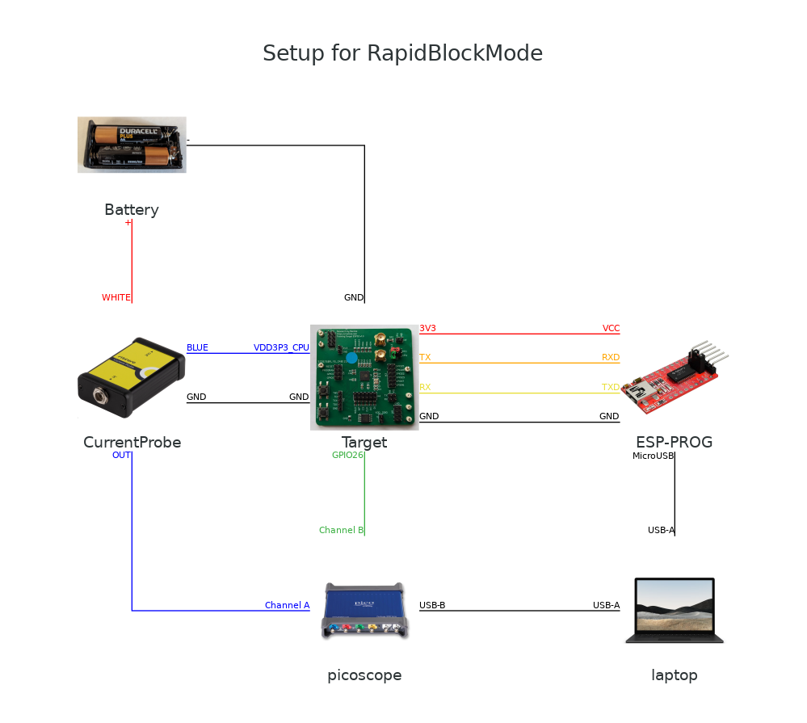

# RapidBlockMode

This repository contains the material required for using Rapid Block Mode on Picoscope 3206d.

**Warning:** This is a research repository; its contents come as-is; most likely broken here and there.

## Bootloader

This bootloader should run on all ESP32 and ESP32 V3 development boards.

You can build it using the following steps (Ubuntu):

* Install the following packages

```bash
raelize@system:~$ sudo apt-get install git wget flex bison gperf python3 python3-pip python3-setuptools cmake ninja-build ccache libffi-dev libssl-dev dfu-util
```

* Checkout a specific version for Espressif's ESP-IDF and install toolchain for the ESP32 SoC

```bash
raelize@system:~$ mkdir ~/rbm/
raelize@system:~$ cd ~/rbm
raelize@system:~/rbm$ git clone -b v5.1.1 --recursive https://github.com/espressif/esp-idf.git
raelize@system:~/rbm$ cd esp-idf
raelize@system:~/rbm/esp-idf$ git checkout e088c3766ba440e72268b458a68f27b6e7d63986
raelize@system:~/rbm/esp-idf$ ./install.sh esp32
```

* Clone this repository

```bash
raelize@system:~$ cd ~/rbm
raelize@system:~/rbm$ git clone https://github.com/raelize/RapidBlockMode.git
raelize@system:~/rbm$ cd RapidBlockMode/bootloader
```

* Initialize the build environment

```bash
raelize@system:~/rbm/RapidBlockMode/bootloader$ . ~/rbm/esp-idf/export/sh
raelize@system:~/rbm/RapidBlockMode/bootloader$ idf.py bootloader
```

* Now you should have a bootloader in the build directory

```bash
raelize@system:~/rbm/RapidBlockMode/bootloader$ ls build/bootloader/bootloader.bin -lah
-rw-rw-r-- 1 raelize raelize 23K apr  9 09:34 build/bootloader/bootloader.bin
```

* This bootloader can be flash to an ESP32 development board

```bash
raelize@system:~/rbm/RapidBlockMode/bootloader$ esptool.py write_flash 0x1000 build/bootloader/bootloader.bin
```

* You should check if you see `RapidBlockMode...` on the serial interface.

## Bootloader commands

The bootloader implements the following commands:

```C
switch(command) {

    // set key
    case 'K':
        for(int i = 0; i < 16; i++) {
            while(esp_rom_uart_rx_one_char(&tkey[i]) != 0){};
        }
        esp_rom_printf("OK\n");
        break;

    // averaged encryptions
    case 'L':
        
        while(esp_rom_uart_rx_one_char(&h) != 0){};
        while(esp_rom_uart_rx_one_char(&l) != 0){};

        iterations = ((uint16_t)h << 8) | l;

        /* get input */
        for(int i = 0; i < 16; i++) {
            while(esp_rom_uart_rx_one_char(&tin[i]) != 0){};
        }

        /* set key */
        ets_aes_setkey_enc(tkey, AES128);

        for(int i= 0; i < iterations; i++) {
            GPIO_OUTPUT_SET(26,1);
            ets_aes_crypt(tin, tout);
            GPIO_OUTPUT_SET(26,0);
        }

        /* print output */
        printhex(tout);
        break;

    // generate input with AES engine based of input
    case 'M':
    
        /* set key */
        ets_aes_setkey_enc(tkey, AES128);

        // iterations
        while(esp_rom_uart_rx_one_char(&h) != 0){};
        while(esp_rom_uart_rx_one_char(&l) != 0){};
        iterations = ((uint16_t)h << 8) | l;

        /* get input (seed) */
        for(int i = 0; i < 16; i++) {
            while(esp_rom_uart_rx_one_char(&input[i]) != 0){};
        }

        /* as many encryptions as iterations */
        for(int i= 0; i < iterations; i++) {
    
            /* attack here */
            GPIO_OUTPUT_SET(26,1);
            ets_aes_crypt(input, input);
            GPIO_OUTPUT_SET(26,0);
        }

        /* print output */
        esp_rom_printf("OK\n");
        break;
```

## Picoscope's SDK and Python Wrappers

For these scripts to work you need to install Picoscope's SDK and Python Wrappers. 

Also, we tested this only on Windows, but it should work on Linux [too](https://pypi.org/project/picosdk/).

* Install [Python](https://www.python.org/downloads/release/python-3122/)

* Install the following Python modules: 

```bash
raelize@system:~/rbm$ pip install numpy pyserial matplotlib trsfile pycryptodome
```

* Install [PicoSDK](https://www.picotech.com/downloads)

* Install Picoscope Python Wrappers

```bash
raelize@system:~/rbm$ git clone https://github.com/picotech/picosdk-python-wrappers.git
raelize@system:~/rbm$ cd picosdk-python-wrappers-master
raelize@system:~/rbm/picosdk-python-wrappers-master$ pip install .
```

* Now you can use the `scripts/test_connection_with_scope.py` to check if everything is installed correctly

## Scripts

**script_0_rbm_block.py**

This script encrypts a block with the hardware AES engine of the Espressif ESP32.

The block is written to disk using Riscure's [trsfile](https://github.com/Riscure/python-trsfile) format.

**script_1_rbm_averaged.py**

This script encrypts a multiple blocks with the hardware AES engine of the Espressif ESP32.

These blocks are averaged (i.e., they have the same input data) and written to disk using Riscure's [trsfile](https://github.com/Riscure/python-trsfile) format.

## Setup




